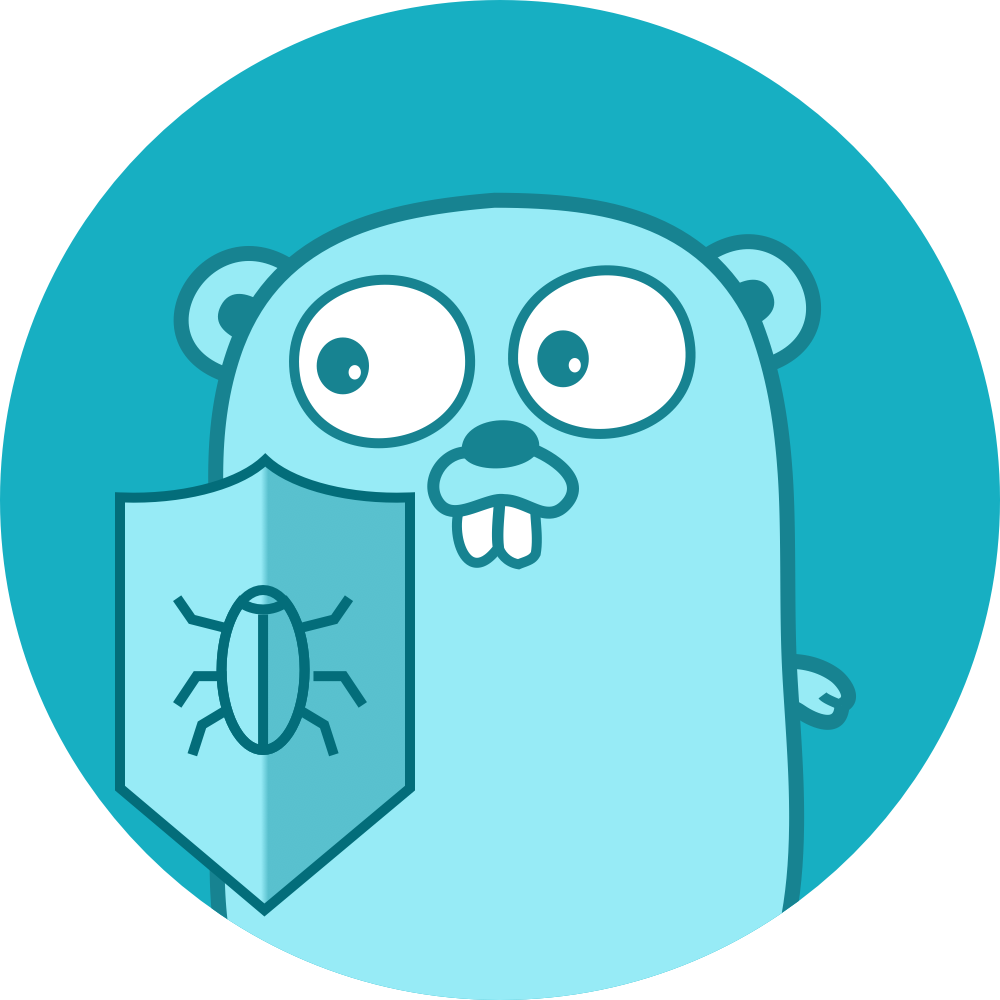

  
  <h3 align="center">golangci-lint</h3>
  
Fast linters runner for Go

---

`golangci-lint` is a fast Go linters runner.

It runs linters in parallel, uses caching, supports YAML configuration,
integrates with all major IDEs, and includes over a hundred linters.

## Install `golangci-lint`

- [On my machine](https://golangci-lint.run/welcome/install/#local-installation);
- [On CI/CD systems](https://golangci-lint.run/welcome/install/#ci-installation).

## Documentation

Documentation is hosted at https://golangci-lint.run.

## Social Networks

## Supporting Us

`golangci-lint` is a free and open-source project built by volunteers.

If you value it, consider supporting us, we appreciate it! :heart:

## Badges

## Contributors

This project exists thanks to all the people who contribute. [How to contribute](https://golangci-lint.run/contributing/quick-start/).

<!-- BEGIN AUTOGENERATED CONTRIBUTORS -->
<!-- prettier-ignore-start -->
<!-- markdownlint-disable -->
### Core Team

About core team

The GolangCI Core Team is a group of contributors who have demonstrated a lasting enthusiasm for the project and community.
The GolangCI Core Team has GitHub admin privileges on the repo.

#### Responsibilities

The Core Team has the following responsibilities:

1. Being available to answer high-level questions about vision and future.
2. Being available to review longstanding/forgotten pull requests.
3. Occasionally check issues, offer input, and categorize with GitHub issue labels.
4. Looking out for up-and-coming members of the GolangCI community who might want to serve as Core Team members.
5. Note that the Core Team – and all GolangCI contributors – are open-source volunteers; membership on the Core Team is expressly not an obligation. The Core Team is distinguished as leaders in the community and while they are a good group to turn to when someone needs an answer to a question, they are still volunteering their time, and may not be available to help immediately.

<!-- markdownlint-enable -->
<!-- prettier-ignore-end -->
<!-- END AUTOGENERATED CONTRIBUTORS -->

## Stargazers over time

